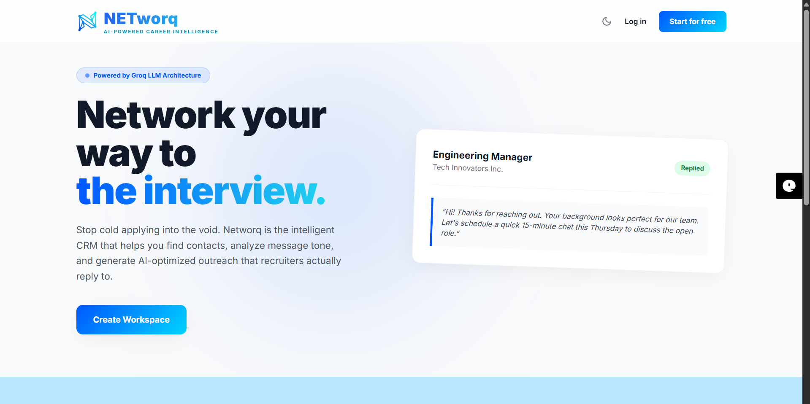
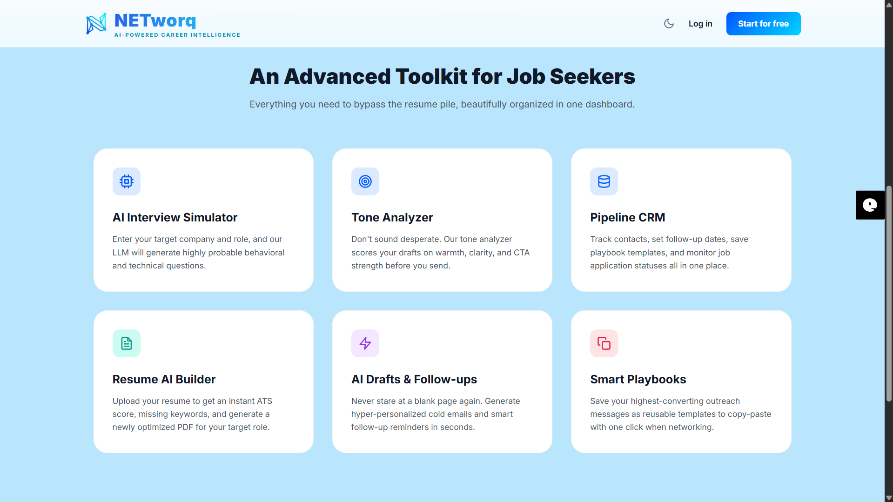
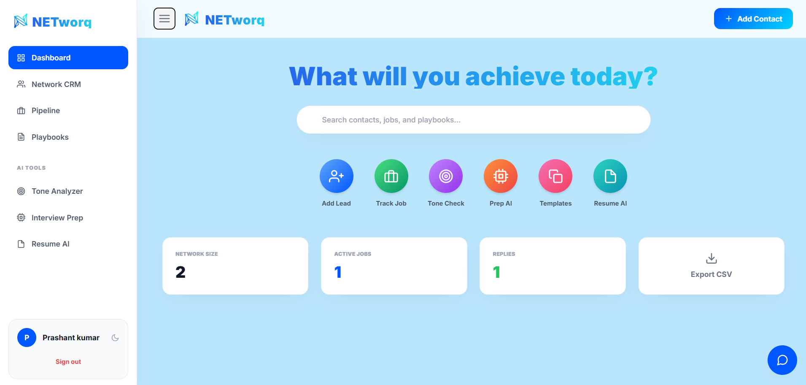

# Networq
### AI-Powered Career Intelligence

**Live Demo:** [https://coldmail-ai-eight.vercel.app](https://coldmail-ai-eight.vercel.app)

---

## Project Overview
Networq is a comprehensive, full-stack career management ecosystem designed to streamline the job search process for modern professionals. By integrating a traditional Customer Relationship Management (CRM) system with high-speed Large Language Model (LLM) architecture, the platform automates complex tasks such as personalized networking, interview preparation, and resume optimization.

## The Problem It Solves
The modern job search is often fragmented and inefficient. Candidates typically rely on disparate tools for tracking applications, drafting outreach, and preparing for interviews. Networq provides a centralized command center that eliminates this fragmentation, offering tools that analyze communication tone, simulate role-specific interviews, and score resumes against industry standards in real-time.

---

## Core Features and Functionality

* **Pipeline CRM:** A dedicated system for managing recruiter contacts and monitoring job application lifecycle statuses.
* **Resume AI Builder:** An advanced analyzer providing instant ATS compatibility scores, identifying missing keywords, and generating optimized PDF resumes.
* **AI Interview Simulator:** A role-specific preparation tool that generates technical and behavioral questions tailored to target companies.
* **Tone and Sentiment Analyzer:** A communication utility that evaluates draft messages for clarity, warmth, and Call-to-Action (CTA) strength.
* **AI Outreach Drafter:** An automated system for generating hyper-personalized cold emails and follow-up sequences.
* **Smart Playbooks:** A centralized library for saving and managing high-performing outreach templates for rapid execution.

---

## Technical Architecture
The platform utilizes a modern, serverless architecture optimized for high performance and low latency.

* **Backend Environment:** Python utilizing the Flask framework.
* **Intelligence Layer:** Groq Cloud API powered by Llama-3 LLM architecture.
* **Database Management:** MongoDB Atlas for secure, cloud-based data persistence.
* **Frontend Design:** HTML5, CSS3, and Vanilla JavaScript styled with Tailwind CSS for a responsive, dark-mode-enabled interface.
* **Infrastructure:** Hosted and deployed via Vercel using serverless functions.

---

## User Dashboard
The dashboard provides a high-glance utility view, allowing users to track their networking size, active applications, and response rates while accessing the suite of AI tools.

---

## Engineering Challenges Overcome
As a software engineering project, Networq involved navigating several technical hurdles to transition from a local environment to a production-ready cloud application:

1. **Serverless Logic Restructuring:** Adapting the Flask application for Vercel’s serverless environment required a total redesign of the directory structure and the implementation of custom routing rules.
2. **Dynamic Asset Pathing:** Custom relative pathing logic was developed to ensure consistent delivery of frontend assets within an isolated serverless execution context.
3. **LPU Integration:** To achieve near-instantaneous AI responses, the platform utilizes Groq’s LPU (Language Processing Unit) architecture to minimize the latency usually associated with large language models.

---

## Limitations and Future Roadmap
Networq is currently in active development as part of a placement preparation initiative.

**Current Limitations:**
* **Third-Party API Dependency:** AI features are dependent on the uptime and rate limits of the Groq API.
* **Manual Delivery:** Outreach generation is currently a "copy-and-paste" workflow rather than a direct SMTP integration.
* **Generation Latency:** High-fidelity PDF generation may experience slight delays due to serverless resource allocation.

**Planned Features (Work in Progress):**
* **Direct Email Integration:** Native support for sending outreach directly via Gmail or Outlook APIs.
* **LinkedIn Browser Extension:** Automation for importing recruiter profiles and job descriptions directly into the CRM.
* **Success Metrics:** Advanced analytics to track response rates and A/B test outreach performance.

---

### Developed By
**[Prashant](https://www.linkedin.com/in/prashant-kumar-49775029a/)**